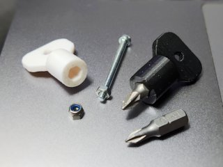
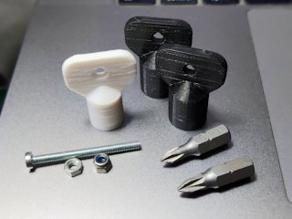

# Mini Hex Key Socket Wrench
*3D printable key-style socket wrenches for M2, M2.5, M3, M4 nuts, and hex screwdriver bits (formerly thing:1959962)*

### License
[Creative Commons - Attribution](https://creativecommons.org/licenses/by/4.0/)

### Gallery

[🔎](images/photo1.jpg) [🔎](images/photo2.jpg)

## Description and Instructions

This is a simple key- or thumbscrew-shaped socket wrench for metric nuts between M2 and M4, for those times when space is cramped.

Sizes provided are M2, M2.5, M3, and M4. There is also a model that fits hex screwdriver bits.

Unless you can print these in actual metal, you should of course not expect too much from these, they are meant for light duty work that does not involve a lot of torque.

### Printing

The strength of the end result will depend a lot on the material and print parameters. For most consumer printers, the best option is probably **PETG** in 0.1 or 0.15 mm layers, with minimal cooling. If you can print in polycarbonate, it would be better, but even then you should keep in mind that plastic is not metal.

Print with 4 perimeters. This should already result in the models being almost solid regardless of the infill, but you can still set infill to 100% to fill up any remaining voids.

Unfortunately you would be extremely lucky if you simply print this and get an immediate perfect fit. There is too much variability in 3D printers and even the 3D printing process within a single printer, to obtain perfect tolerances from the first time. The tolerances I used in the models work well for my particular printer, but probably not for yours. **You will most likely need to go through a few iterations to obtain well-fitting wrenches.**

Instead of printing an entire wrench or the whole set from the start, it is a good idea to start by only printing the lower 6 mm of each model to save time and filament. Either cut the models or just abort the print at that point. Then check the fit for each of these partial prints against actual nuts or hex bits. If the hole for a wrench is too tight, scale up its model: create a few copies that are scaled up in steps of 1% (101%, 102%, …) Conversely, if the hole is too sloppy, create copies that are scaled down in steps of 1 percent (99%, 98%, …) 
Print these scaled sets and repeat the process until the fit is right. It is essential that you keep using the exact same print settings during this whole process, and also that you always print the same number of parts. Any big change in these parameters is likely to affect the tolerances of the end result.

For the screwdriver hex bit wrench, it is a waste of time to aim for a nice friction fit. Even if you get a perfect fit for a particular bit, it will probably not be perfect for other bits, and even for the same bit it will likely become too tight when using the wrench in a much colder environment due to the fact that plastic shrinks and expands a lot more with temperature than metal.
You should deliberately print the hex bit wrench rather sloppy, and glue a tiny **magnet** inside it. A recess is provided for a round magnet of up to 6 mm diameter, about 1.5 mm thick.

## Updates

### 2016/12/11
Published original M3 wrench on Thingiverse.

### 2022/07/31
Migrated to GitHub and re-designed the model, added hex bit variant and more metric sizes between M2 and M4. License is now CC-BY.

## Tags
`hex`, `hex nut`, `key`, `m3 nut`, `socket`, `socket wrench`, `spanner`, `tool`, `wrench`